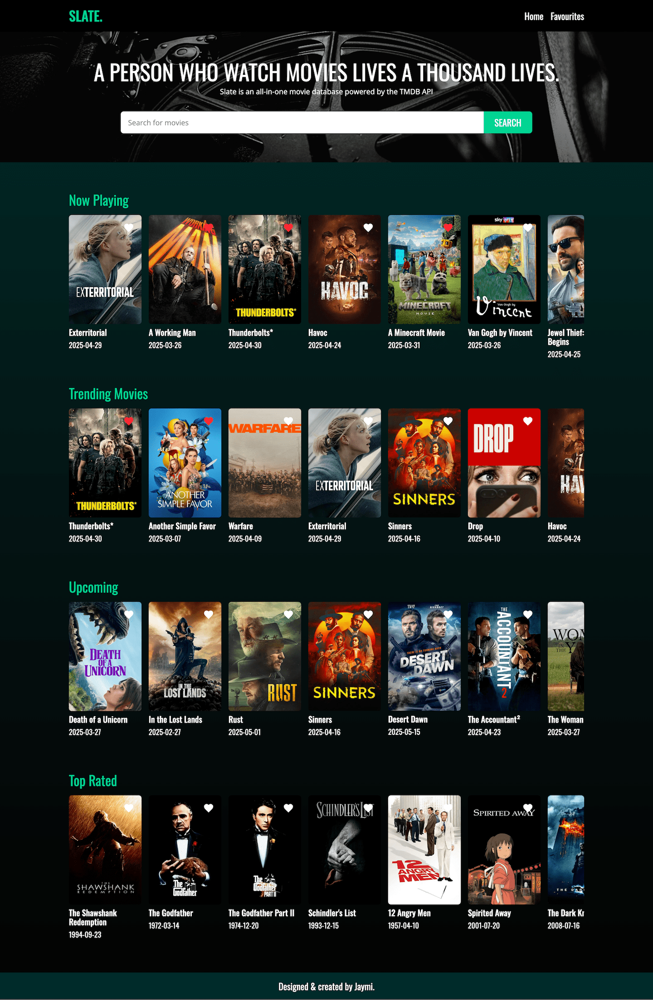

# 🎬 Slate – Movie Discovery App

Slate is a sleek, responsive movie discovery app built with **React** and powered by **The Movie Database (TMDB) API**. Users can explore trending movies, search by title and view detailed movie info, and add favourites—saved locally for a personalized experience.

---

## 📸 Screenshots

---

## 🌟 Features

- 🔍 **Search** for movies by title
- 🎞️ **Browse** trending and popular movies from TMDB
- ❤️ **Favourite** movies (stored in local storage)
- 📄 **View details** like synopsis, rating, release date, and more
- 📱 Fully **responsive** layout for mobile and desktop

---

## 🛠️ Tech Stack

- **React** – UI framework
- **TMDB API** – Movie data source
- **React Router** – Routing
- **Tailwind CSS** – Styling
- **Local Storage** – For persisting favourites
- **Vite** – Development tooling

---

## 📌 To-Do / Improvements

- [ ] Pagination for search results
- [ ] Sort options (by rating, popularity, etc.)
- [ ] User authentication for cloud-synced favourites
- [ ] Cast and trailer info in movie details
- [ ] Dark mode toggle 🌙
